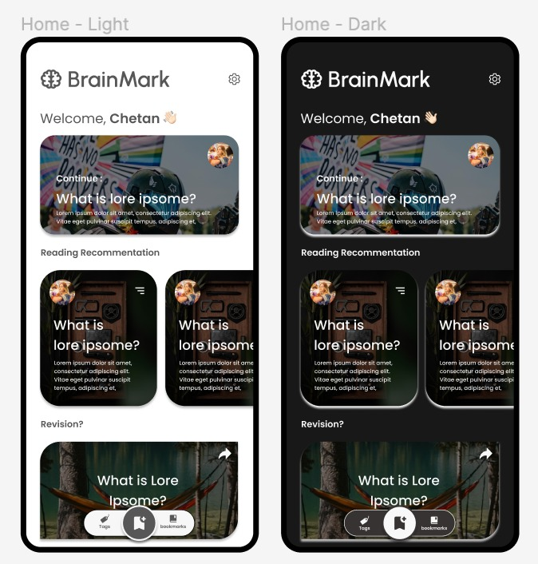
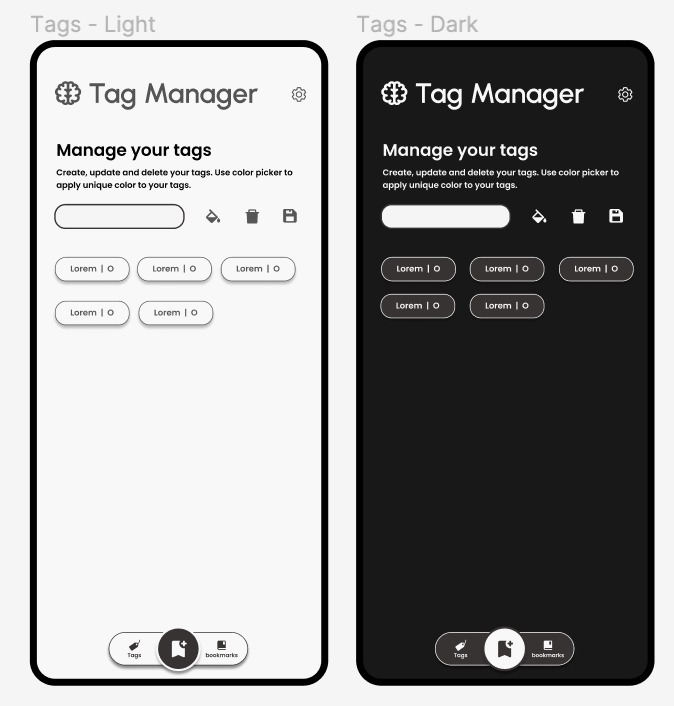
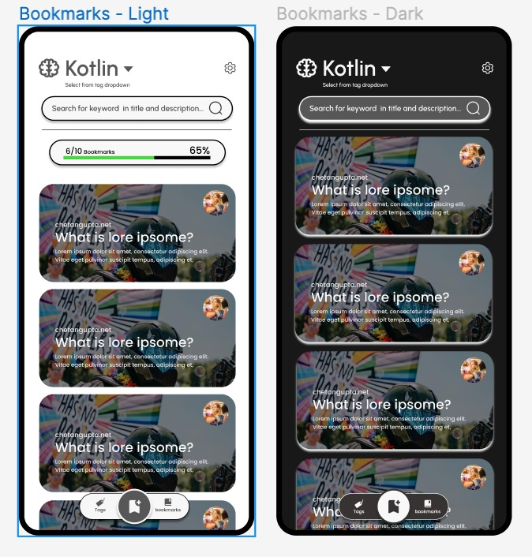

# Brainmark - WIP

KMM Bookmark Manager

# Application Features

1. Create tags
2. Add bookmarks and apply tags
3. reminder for bookmarks to revisit
4. archive read bookmarks
5. attach notes with bookmarks if required
6. export/import bookmark as CSV
7. Sync bookmarks between devices

# Design System

[Figma link](https://www.figma.com/file/mexiothtFvdlsQ5G8Pnfx1/BrainMark?node-id=0%3A1)

<table>
  <tr> <h3>Mobile Wireframes - Android & IOS</h3>  </tr>
  <tr></tr>
  <tr></tr>
  <tr></tr>
</table>

# Engagement?

1. Streak of reading daily

# Application TechStack

1. Kotlin Multiplatform : TODO links
    1. Target Platform
        1. Android
        2. Desktop
        3. Website - To be added
        4. Chrome extension - To be added
        5. IOS - To be added
        6. Server - Ktor
2. Local Database
    1. Sql Delight
        1. Android - SQLlite
        2. Desktop - SQLlite
        3. Website - to be added
        4. Chrome Extension - to be added
        5. IOS - to be added
        6. Server - to be added

