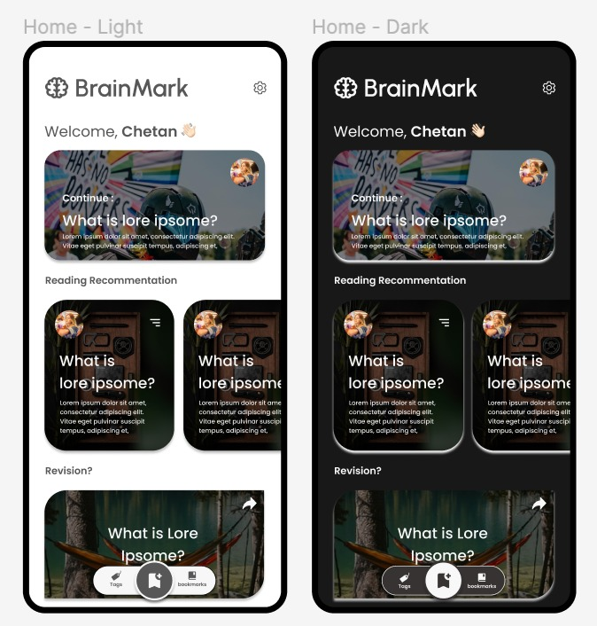
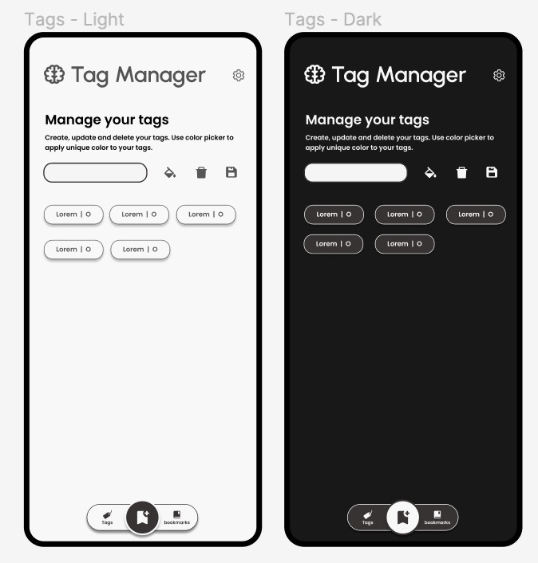
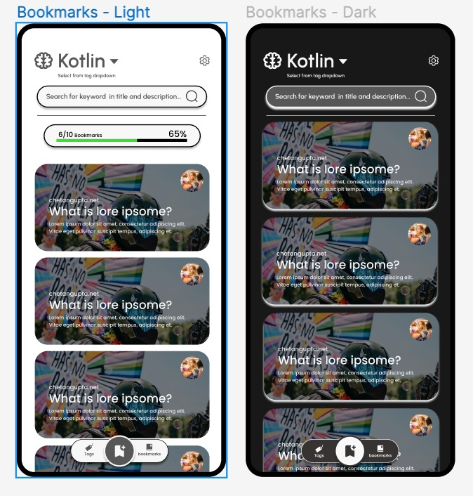

# Brainmark - WIP

KMM Bookmark Manager

# Inspiration

I bookmark lots of articles and videos and never revisit them, It would have been great if I could get some
notifications regarding bookmarks that are getting old and could lose relevance, and even if I reviewed them, having
some way to extract key points would be great.

So with this application I'm planning create a system where I can search my bookmarks, store key points, and search
through all of them.

# Contribution

I have been building this from Scratch, Contributions are welcome in form of PRs. Before your contribution I would like
you to open a discussion or Issue on the Github Repository. I'm open for all the feedback regarding application
architecture, features and platforms.

# Application Features

1. Add Bookmark manually by opening form
2. Add Bookmark by share shortcut,
3. Format time supported is url so url formats are supported
4. You can CRUD tags and apply them to Bookmark
5. Bookmarks are filtered based on Tags
6. UnTagged bookmarks can be filtered separately.
7. Every bookmark is scheduled for read later
8. Once readed then should be marked archived
9. On archievd you are asked to submit summary/keypoints as links in the page
10. Keypoints are displayed as - reminders or flashcards - on home page or in app notificatiins
11. Database should be synced to multiple devices/platform thus require server
    1. Server db could be google sheet? -- not sure

# Design System

[Figma link](https://www.figma.com/file/mexiothtFvdlsQ5G8Pnfx1/BrainMark?node-id=0%3A1)

# Preview - WIP

<table>
  <tr> <h3>Mobile Wireframes - Android & IOS</h3> </tr>
  <tr></tr>
  <tr></tr>
  <tr></tr>
</table>

# Application TechStack

1. Kotlin Multiplatform for code sharing
2. Gradle Plugins
    1. buildKonfig - Multiplatform BuildConfig.
3. Common Code :
    1. Database
        1. SqlDelight + GradlePlugin
    2. Network
        1. Ktor
    3. Dependency Injection
        1. Manual DI
    4. Async
        1. Coroutines
        2. Flows
    5. Navigation
        1. Decompose
    6. Utils
        1. SerializationX
        2. UUID
        3. Lifecycle - Multiplatform
        4. Decompose - Lifecycle
        5. Decompose - BackPressDispatcher
        6. Decompose - Parcelable
        7. DataTime - KotlinX
    7. Resources
        1. MokoResources + GradlePlugin - Font Loading

4. Android :
    1. Image loading
        1. Coil
    2. UI toolkit
        1. Jetpack Compose
        2. Accompanist
            1. FlowLayout
            2. PlaceHolder
        3. Android Components
            1. WebView
    3. Utilities
5. Desktop : WIP
6. Server : WIP
7. IOS : WIP
8. Web : WIP
9. Wear OS : WIP
